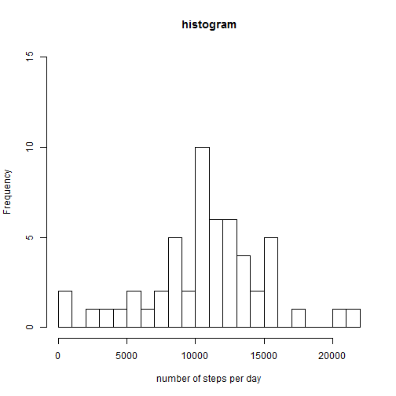
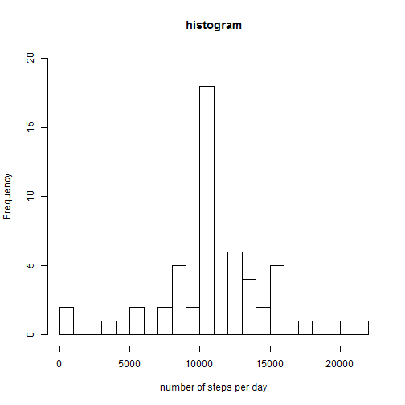

# Reproducible Research: Peer Assessment 1
Hi coursera fellow , thanks for your time.
Rmarkdown for Peer Assessment 1

## Loading and preprocessing the data

```r
unzip("activity.zip")
activity <- read.csv("activity.csv",colClasses=c("numeric","Date","numeric"))
str(activity)
```

```
## 'data.frame':	17568 obs. of  3 variables:
##  $ steps   : num  NA NA NA NA NA NA NA NA NA NA ...
##  $ date    : Date, format: "2012-10-01" "2012-10-01" ...
##  $ interval: num  0 5 10 15 20 25 30 35 40 45 ...
```

## What is mean total number of steps taken per day?
1- Histogram of the number of steps per day (x) by using aggrgate function :

```r
x <- aggregate (steps~date,activity,sum)
hist(x[,2],main="histogram",xlab="number of steps per day",ylim=c(0,15),breaks=20)
```

 

2- Mean and Median daily activities :

```r
mean(x[,2])
```

```
## [1] 10766
```

```r
median(x[,2])
```

```
## [1] 10765
```


## What is the average daily activity pattern? 
1-Make a time series plot of the 5 minutes interval(x-axis) and the average daily steps :

```r
y <- aggregate (steps~interval,activity,mean)
plot(y,type="l")
```

 
-More activity early in the morning.

2- Interval containing the max number of steps :


```r
y[y$steps==max(y$steps),]
```

```
##     interval steps
## 104      835 206.2
```

## Imputing missing values
1- Calculate and report the total number of missing values in the dataset

```r
sum(is.na(activity))
```

```
## [1] 2304
```
2-Devise a strategy for filling in all of the missing values in the dataset, i am replacing missing values (NA) in steps variable by the 5 minutes intervals means.I just used a simple approch : by looking at data i did notice tht data are missing for these 8 days : 2012-10-01 2012-10-08 2012-11-01 2012-11-04 2012-11-09 2012-11-10 
 2012-11-14 and 2012-11-30 , i replaced their steps missing values by the intervals means like this : 

```r
w1 <- activity[(activity[,2] == "2012-10-01"),]$steps <- y$steps
w2 <- activity[(activity[,2] == "2012-10-08"),]$steps <- y$steps
w3 <- activity[(activity[,2] == "2012-11-01"),]$steps <- y$steps
w4 <- activity[(activity[,2] == "2012-11-04"),]$steps <- y$steps
w5 <- activity[(activity[,2] == "2012-11-09"),]$steps <- y$steps
w6 <- activity[(activity[,2] == "2012-11-10"),]$steps <- y$steps
w7 <- activity[(activity[,2] == "2012-11-14"),]$steps <- y$steps
w8 <- activity[(activity[,2] == "2012-11-30"),]$steps <- y$steps
activity1 <- activity
```
# we have now a new dataset activity1 with no missing values for steps:

```r
str(activity1)
```

```
## 'data.frame':	17568 obs. of  3 variables:
##  $ steps   : num  1.717 0.3396 0.1321 0.1509 0.0755 ...
##  $ date    : Date, format: "2012-10-01" "2012-10-01" ...
##  $ interval: num  0 5 10 15 20 25 30 35 40 45 ...
```

```r
sum(is.na(activity1))
```

```
## [1] 0
```
3-Make a histogram of the total number of steps taken each day and Calculate and report the mean and median total number of steps taken per day. Do these values differ from the estimates from the first part of the assignment? What is the impact of imputing missing data on the estimates of the total daily number of steps?

```r
x <- aggregate (activity$steps~activity$date,activity,sum)
hist(x[,2],main="histogram",xlab="number of steps per day",ylim=c(0,20),breaks=20)
```

 

```r
mean(x[,2])
```

```
## [1] 10766
```

```r
median(x[,2])
```

```
## [1] 10766
```
 -The distribution of total daily steps looks similar for both datasets. 
 The total number of daily steps did increase but the mean is the same. 
 also for the second data distribution the mean and median are the same ,this
 might be due to the NA replacement by the means coming from the data itself. 
 
## Are there differences in activity patterns between weekdays and weekends?
1-Create a new factor variable in the dataset with two levels - "weekday" and "weekend" indicating whether a given date is a weekday or weekend day, by using 
sapply on date variable to extract the desired type of day with the help of the created function datetype .


```r
daytype <- function(date){
  if(weekdays(as.Date(date)) %in% c("Saturday","Sunday")) {
    "weekend"
  }else{
    "weekday"
  }  
}
activity1$daytype <- as.factor(sapply(activity1$date,daytype))
head(activity1)
```

```
##     steps       date interval daytype
## 1 1.71698 2012-10-01        0 weekday
## 2 0.33962 2012-10-01        5 weekday
## 3 0.13208 2012-10-01       10 weekday
## 4 0.15094 2012-10-01       15 weekday
## 5 0.07547 2012-10-01       20 weekday
## 6 2.09434 2012-10-01       25 weekday
```

2-Make a panel plot containing a time series plot (i.e. type = "l") of the 5-minute interval (x-axis) and the average number of steps taken,averaged across all weekday days or weekend days (y-axis).


```r
par(mfrow=c(2,1))
for( type in c("weekend","weekday")){
     steps.type <- aggregate(steps ~ interval, data = activity1, subset = activity1$daytype==type,FUN=mean)
   plot(steps.type,type ="l",main = type)
} 
```

 

-Similar activities for both days in the morning , but more activity in weekend for the rest  of the day. 

