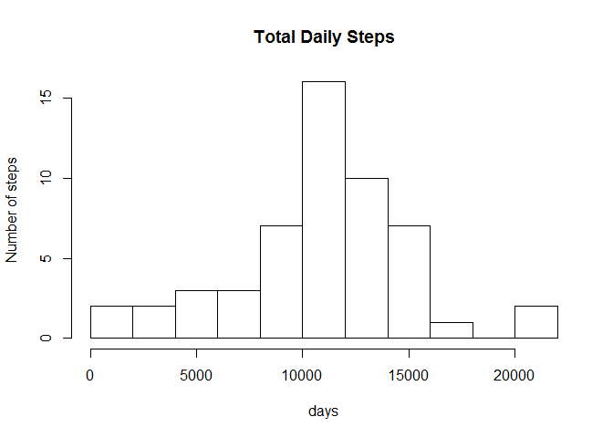
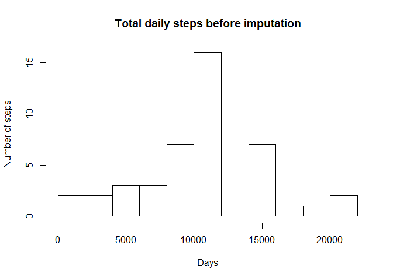
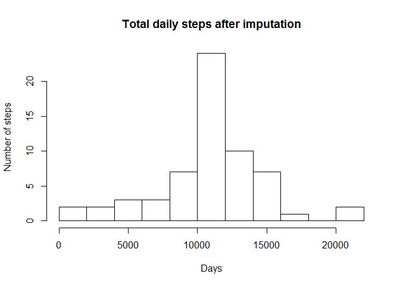
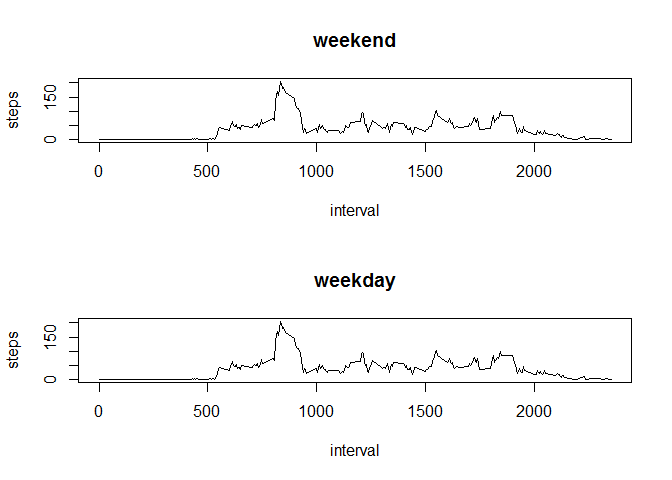

# Reproducible Research: Peer Assessment 1
Hi coursera fellow , thanks for your time.
Rmarkdown for Peer Assessment 1

## Loading and preprocessing the data

```r
unzip("activity.zip")
```

```
## Warning: error 1 in extracting from zip file
```

```r
activity <- read.csv("activity.csv",colClasses=c("numeric","Date","numeric"))
str(activity)
```

```
## 'data.frame':	17568 obs. of  3 variables:
##  $ steps   : num  NA NA NA NA NA NA NA NA NA NA ...
##  $ date    : Date, format: "2012-10-01" "2012-10-01" ...
##  $ interval: num  0 5 10 15 20 25 30 35 40 45 ...
```

## What is mean total number of steps taken per day?
1- Histogram of the number of steps per day (x) by using aggrgate function :

```r
x <- aggregate (steps~date,activity,sum)
hist(x$steps,main="Total Daily Steps",xlab="days",ylab="Number of steps",breaks=10)
```

 

2- Mean and Median daily activities :

```r
mean(x$steps)
```

```
## [1] 10766
```

```r
median(x$steps)
```

```
## [1] 10765
```


## What is the average daily activity pattern? 
1-Make a time series plot of the 5 minutes interval(x-axis) and the average daily steps :

```r
y <- aggregate (steps~interval,activity,mean)
plot(y,type="l")
```

 
-More activity early in the morning.

2- Interval containing the max number of steps :


```r
y[y$steps==max(y$steps),]
```

```
##     interval steps
## 104      835 206.2
```

## Imputing missing values
1- Calculate and report the total number of missing values in the dataset

```r
sum(is.na(activity))
```

```
## [1] 2304
```
2-Devise a strategy for filling in all of the missing values in the dataset, i am replacing missing values (NA) in steps variable by the 5 minutes intervals means.subset activity in naactivity and nonaactivity , use match() ,and rbind the resulting datas. 

```r
naactivity <- activity[is.na(activity$steps),] 
nonaactivity <- activity[!is.na(activity$steps),]
head(naactivity)
```

```
##   steps       date interval
## 1    NA 2012-10-01        0
## 2    NA 2012-10-01        5
## 3    NA 2012-10-01       10
## 4    NA 2012-10-01       15
## 5    NA 2012-10-01       20
## 6    NA 2012-10-01       25
```

```r
head(nonaactivity)
```

```
##     steps       date interval
## 289     0 2012-10-02        0
## 290     0 2012-10-02        5
## 291     0 2012-10-02       10
## 292     0 2012-10-02       15
## 293     0 2012-10-02       20
## 294     0 2012-10-02       25
```

```r
head(y)
```

```
##   interval   steps
## 1        0 1.71698
## 2        5 0.33962
## 3       10 0.13208
## 4       15 0.15094
## 5       20 0.07547
## 6       25 2.09434
```

```r
logical <- match(y$interval,naactivity$interval)
naactivity[,"steps"] <- y[match(y$interval,naactivity$interval),2]
impactivity <- rbind(naactivity,nonaactivity)
str(impactivity)
```

```
## 'data.frame':	17568 obs. of  3 variables:
##  $ steps   : num  1.717 0.3396 0.1321 0.1509 0.0755 ...
##  $ date    : Date, format: "2012-10-01" "2012-10-01" ...
##  $ interval: num  0 5 10 15 20 25 30 35 40 45 ...
```
all  naactivity steps are replaced with y$steps (288 values replicated)
now rbind naactivity and nonaactivity to have a complete imputed data but the rows
order is different form activity rows order 
we have now a new dataset impactivity with no missing values for steps:

```r
str(activity)
```

```
## 'data.frame':	17568 obs. of  3 variables:
##  $ steps   : num  NA NA NA NA NA NA NA NA NA NA ...
##  $ date    : Date, format: "2012-10-01" "2012-10-01" ...
##  $ interval: num  0 5 10 15 20 25 30 35 40 45 ...
```

```r
sum(is.na(activity))
```

```
## [1] 2304
```
3-Make a histogram of the total number of steps taken each day and Calculate and report the mean and median total number of steps taken per day. Do these values differ from the estimates from the first part of the assignment? What is the impact of imputing missing data on the estimates of the total daily number of steps?

```r
x1 <- aggregate (steps~date,impactivity,sum)
#par(mfrow=c(2,1))
hist(x$steps,main="Total daily steps before imputation",xlab="Days",
     ylab="Number of steps",breaks=10)
```

 

```r
hist(x1$steps,main="Total daily steps after imputation",xlab="Days",
     ylab="Number of steps",breaks=10)
```

 

```r
sum(x1$steps)  
```

```
## [1] 656738
```

```r
mean(x1$steps)
```

```
## [1] 10766
```

```r
median(x1$steps)
```

```
## [1] 10766
```
 -The distribution of total daily steps looks similar for both datasets. 
 The total number of daily steps did increase but the mean is the same. 
 also for the second data distribution the mean and median are the same ,this
 might be due to the NA replacement by the means coming from the data itself. 
 
## Are there differences in activity patterns between weekdays and weekends?
1-Create a new factor variable in the dataset with two levels - "weekday" and "weekend" indicating whether a given date is a weekday or weekend day, by using 
sapply on date variable to extract the desired type of day with the help of the created function datetype .


```r
day <- function(date){
  if(weekdays(date) %in% c("Saturday","Sunday")) {
    "weekend"
  }else{
    "weekday"
  }  
}
impactivity$day <-sapply(impactivity$date,day)
head(impactivity)
```

```
##     steps       date interval     day
## 1 1.71698 2012-10-01        0 weekday
## 2 0.33962 2012-10-01        5 weekday
## 3 0.13208 2012-10-01       10 weekday
## 4 0.15094 2012-10-01       15 weekday
## 5 0.07547 2012-10-01       20 weekday
## 6 2.09434 2012-10-01       25 weekday
```

2-Make a panel plot containing a time series plot (i.e. type = "l") of the 5-minute interval (x-axis) and the average number of steps taken,averaged across all weekday days or weekend days (y-axis).


```r
par(mfrow=c(2,1))
for( day in c("weekend","weekday")){
     steps.day <- aggregate(steps ~ interval, data = impactivity, subset = impactivity$day==day,FUN=mean)
   plot(steps.day,type ="l",main = day)
} 
```

 

-Similar activities for both days in the morning , but more activity in weekend for the rest  of the day. 
